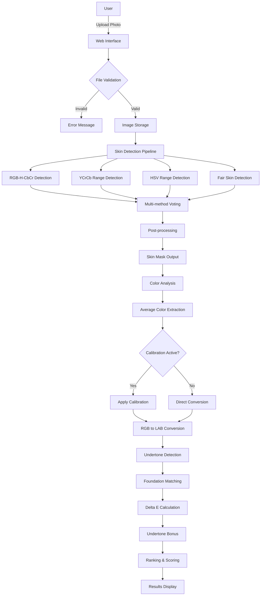
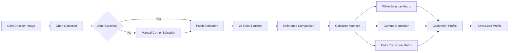
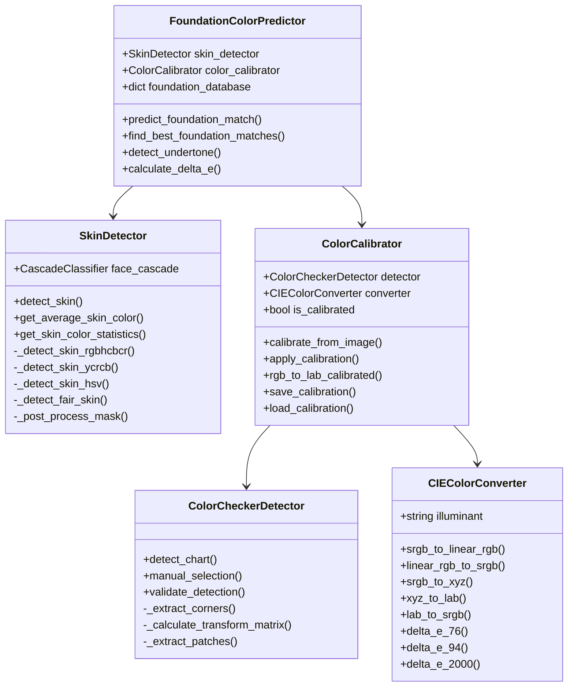
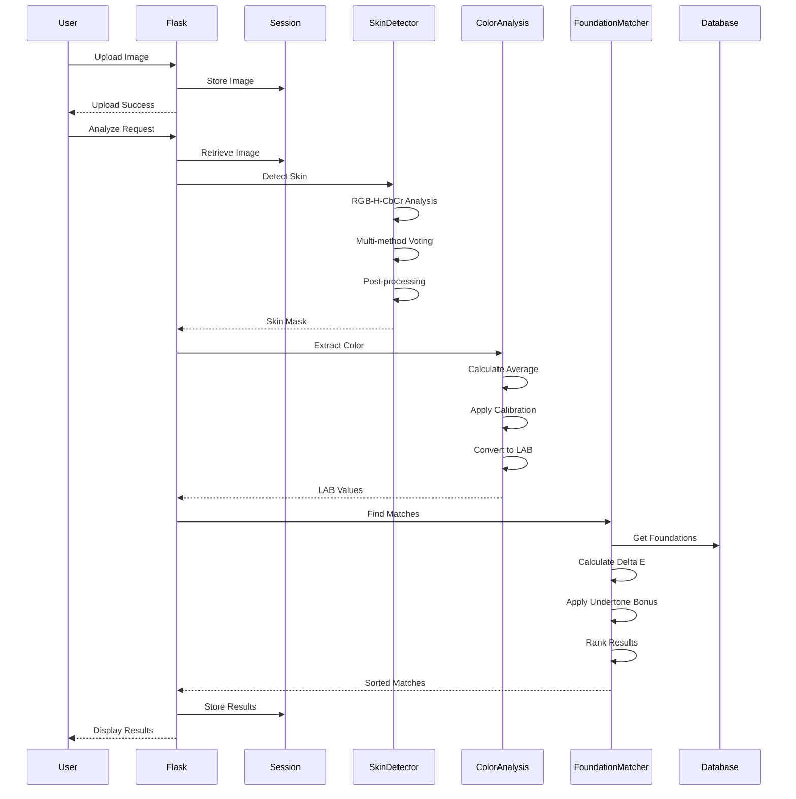
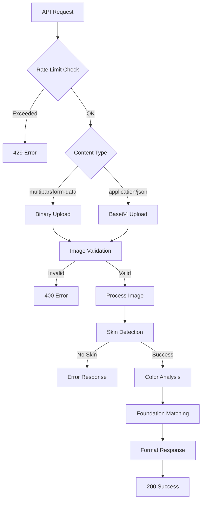
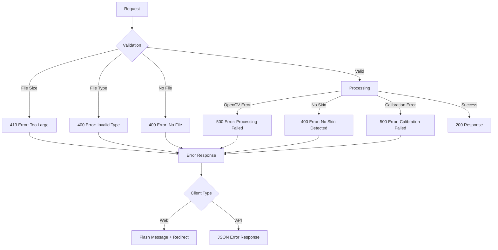

# Makeup Make - Technical Architecture

## System Flow Diagram



## Calibration System Flow



## Class Diagram



## Data Flow Sequence Diagram



## API Request Flow



## Mathematical Processing Pipeline

```
1. Image Input (BGR)
   ↓
2. Color Space Conversions
   ├─> RGB = cv2.cvtColor(BGR, COLOR_BGR2RGB)
   ├─> YCrCb = cv2.cvtColor(BGR, COLOR_BGR2YCrCb)
   └─> HSV = cv2.cvtColor(BGR, COLOR_BGR2HSV)
   ↓
3. Skin Detection Criteria
   ├─> RGB: (R>95) & (G>40) & (B>20) & ...
   ├─> CrCb: Linear boundary conditions
   └─> Hue: (H<25°) | (H>230°)
   ↓
4. Voting System
   skin_mask = (votes >= threshold)
   ↓
5. Color Extraction
   avg_color = mean(image[skin_mask > 0])
   ↓
6. Calibration (Optional)
   calibrated = WB × Gamma × ColorMatrix × RGB
   ↓
7. LAB Conversion
   RGB → Linear RGB → XYZ → LAB
   ↓
8. Undertone Analysis
   warmth = b* / (|a*| + 1)
   ↓
9. Foundation Matching
   ΔE = √[(L₁-L₂)² + (a₁-a₂)² + (b₁-b₂)²]
   ↓
10. Results
    score = max(0, 100 - ΔE × 5)
```

## Technology Stack Architecture

```
┌─────────────────────────────────────────────┐
│                Frontend Layer                │
├─────────────────────────────────────────────┤
│ • HTML5 (Jinja2 Templates)                  │
│ • CSS3 (Bootstrap 5)                        │
│ • JavaScript (Vanilla + AJAX)               │
│ • Drag & Drop API                          │
└─────────────────────────────────────────────┘
                    ↓
┌─────────────────────────────────────────────┐
│              Application Layer               │
├─────────────────────────────────────────────┤
│ • Flask Web Framework                        │
│ • Session Management                         │
│ • File Upload Handling                       │
│ • REST API Endpoints                         │
└─────────────────────────────────────────────┘
                    ↓
┌─────────────────────────────────────────────┐
│            Processing Layer                  │
├─────────────────────────────────────────────┤
│ • OpenCV (Computer Vision)                   │
│ • NumPy (Numerical Computing)                │
│ • scikit-learn (ML Algorithms)              │
│ • PIL/Pillow (Image Processing)             │
└─────────────────────────────────────────────┘
                    ↓
┌─────────────────────────────────────────────┐
│              Data Layer                      │
├─────────────────────────────────────────────┤
│ • In-Memory Foundation Database              │
│ • Session Storage                            │
│ • Temporary File Storage                     │
│ • Calibration Profiles (JSON)               │
└─────────────────────────────────────────────┘
```

## Error Handling Flow



## Performance Optimizations

1. **Vectorized Operations**
   - NumPy array operations for pixel processing
   - Batch color space conversions
   - Efficient boolean indexing

2. **Image Processing Pipeline**
   - Single-pass skin detection
   - Cached calibration matrices
   - Pre-computed foundation database

3. **Memory Management**
   - Temporary file cleanup
   - Session data expiration
   - Limited file size (16MB)

4. **API Rate Limiting**
   - 60 requests/hour per IP
   - Thread-safe request tracking
   - Automatic cleanup of old entries

## Security Measures

1. **File Upload Security**
   - Type validation (MIME + extension)
   - Size limits (16MB max)
   - Secure filename generation (UUID)
   - Isolated upload directory

2. **Session Security**
   - HTTPOnly cookies
   - Secure flag (HTTPS only in production)
   - SameSite protection
   - Secret key rotation

3. **API Security**
   - Rate limiting
   - Input validation
   - Error message sanitization
   - CORS headers for API endpoints

## Deployment Architecture

```
┌─────────────────┐     ┌─────────────────┐
│   Load Balancer │────▶│   Cloud Run     │
└─────────────────┘     │   Instance 1    │
                        └─────────────────┘
                               │
                        ┌─────────────────┐
                        │   Cloud Run     │
                        │   Instance 2    │
                        └─────────────────┘
                               │
                        ┌─────────────────┐
                        │   Cloud Run     │
                        │   Instance N    │
                        └─────────────────┘

Features:
• Auto-scaling based on traffic
• Container-based deployment
• Environment variable configuration
• Health check endpoints
• Graceful shutdown handling
